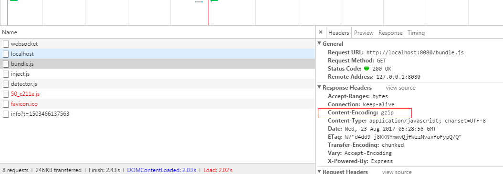

# WebpackStudyDoc[^websit]
[^websit]:适用于本次讲解的项目地址 https://github.com/ppgs8903/WebpackStudyDoc.git
[^ExtractTextPlugin]:插件地址 https://github.com/webpack-contrib/extract-text-webpack-plugin
[^HtmlWebpackPlugin]:插件地址
https://www.npmjs.com/package/html-webpack-plugin

[^part2]:第二部分注解
[^bonjour]:http://bonjour.updatestar.com/zh-cn
[^staticOptions]:http://expressjs.com/en/4x/api.html#express.static
## preface
涉及到的知识
```
graph TD
    cli-->webpack((webpack))
    api-->webpack
    配置-->webpack
    loader-->webpack
    插件-->webpack
    开发-->webpack
```
- cli：命令交互（**稍微涉及**）
- ~~api：不涉及~~
- 配置：通过传入配置，改变webpack 的行为
- loader：对资源进行操作
- ~~开发：不涉及~~

## part 1 - webpack config
webpack.config.js 配置文件和 cli 文件实现的功能基本相同，唯一区别是一个通过命令行，一个通过webpack.config.js配置文件对webpack执行流程进行影响。webpack.config.js可以看做是是配置化的cli。（**这里我们只提供webpack配置相关的讲解，其他相关知识并不会在此次讲解中体现**）

下面是一个base的项目的搭建过程，如果你已经很熟那就请跳过。这个过程并不是一定要遵循的，这我们采用尽量剥离文件的策略，保持webpack的文件干净，不断扩充我们的文件，展现webpack各方面功能。我们由这个demo项目作为base一点一点带大家构建一个webpack可配置的项目，So let's just enjoy it。
1. 在工程目录下初始化一个node 项目，运行npm init，填写要初始化的项目。生成packge.json文件。

2. 安装依赖
- npm install -g webpack
- npm install --save-dev webpack extract-text-webpack-plugin html-webpack-plugin webpack-dev-server --save-dev 
- npm install --save-dev  babel-core babel-loader babel-cli babel-preset-env
从上往下依次是：
全局的webpack，安装后可以在cmd中运行webpack
本地的webpack & webpack插件，本地的webpack 安装后使用相对路径使用，插件则在配置文件中引用。稍后我会演示如何使用webpack插件

3. 修改packge.json内scripts内容，追入我们cmd的命令，运行cmd 命令后可以执行编译切debug。 
如下是一个修改好的packge.json
```json
{
  "name": "base",
  "version": "1.0.0",
  "main": "index.js",
  "scripts": {
    "dev": "webpack -w --progress --colors --config webpack.config.js"
  },
  "author": "",
  "license": "ISC",
  "description": ""
}

```
"scripts": {"dev": "webpack --config webpack.config.js"}表示在使用npm run dev的时候，执行后面的命令。

4. 创建webpack的配置文件 webpack.config.js，配置文件如下
```javascript
const path = require('path')
const HtmlWebpackPlugin = require('html-webpack-plugin')
const ExtractTextPlugin = require('extract-text-webpack-plugin')

module.exports = {
  entry:'./src/index.js',
  output: {
    filename: 'bundle.js',
    path: path.resolve(__dirname, 'dist')
  },
  module: {
    rules: [
      {
        test: /\.js$/,
        use: 'babel-loader',
        exclude: /node_modules/
      }
    ]
  },
  devtool: 'eval-source-map',
  plugins: [
    new HtmlWebpackPlugin({
      template: 'index.ejs',
      inject: true
    })
  ]
}

```
这里我们放入一个最基本的webpack.config.js配置文件
**entry**：
指向入口文件（本例中我们使用单个入口），你可以把它想象成一个C语言里面的main函数。该处是第一个要执行JS。

**output**：
生成出来的文件，这里不解释了

**module**：
资源loader配置位置，我们知道webpack 使用loader加载资源文件，这里可以参考如上配置。

**devtool**：
这里指的是是否输出MAP文件，可以配置成单独生成也可以配置成在文件内生成。

**plugins**：
这里我们使用2个插件
- [ ] ExtractTextPlugin [^ExtractTextPlugin] - 使用该插件可以抽取bundle 资源到一个文件内
- [ ] HtmlWebpackPlugin[^HtmlWebpackPlugin] - ExtractTextPlugin抽取的bundle可能包含md5戳等，HtmlWebpackPlugin帮助我们在资源有变动的时候自动更新我们的首页html文件（**一般是index.html，也可以另行指定**）,本插件默认使用ejs 作为模板，生成html文件。
编译前的


5. 我们改来准备下 babel的配置文件，该文件使我们的浏览器兼容还未支持的js语法。在正常使用的过程中babel的配置文件。首先创建.babelrc，。cv如下内容让webpack来遵循我们的转换准则。
```javascript
{
  "presets": [[
    "env", {
      "targets": {
        "browsers": [ "IE 9" ]
      },
      "modules": false,
      "loose": true
    }
  ]],
  "plugins": [],
  "ignore": [
    "dist/*.js",
    "node_modules/**/*.js"
  ]
}
```

6. 准备一个可以让ExtractTextPlugin、HtmlWebpackPlugin插件写入的模板文件。创建一个index.ejs。代码如下:
```html
<!DOCTYPE html>
<html>
<head>
  <title>cli demo</title>
  <meta content="width=device-width,initial-scale=1,maximum-scale=1,user-scalable=0" name="viewport">
  <meta http-equiv="content-type" content="text/html;charset=utf-8" />
  <meta name='mobile-web-app-capable' content='yes' />
  <meta http-equiv="X-UA-Compatible" content="IE=edge" />
  <link rel="shortcut icon" href="/favicon.ico" />
</head>
<body>
  <div id="app"></div>
</body>
</html>

```

7. 准备webpack.config.js 中entry 指定的index.js
```javascript
let el = document.querySelectorAll('div')
alert(el.length)
```

8. 执行npm run dev 编译我们的代码

9.执行我们的代码


> 以上代码可以在base下找到

## part2 webpack config & webpack plugin
现在我们开始扩充我们的webpack，这里我们从devserver开始
1. webpack dev选项泛称webpack-dev-server，大家可以把他想想成一个写好的express 服务器，其中实现了很多我们开发时需要的功能，如（代理，自定义头，缓存，自动开启浏览器，浏览器报错等） 
2. 现在让我们来展示

名称| 作用
---|---
allowedHosts| 可以访问devserver的数组
bonjour | 内网广播，使用苹果bonjour服务，即使不配置DNS和IP也可以访问[^bonjour]
clientLogLevel| 配置控制台内的输出（可以配置nome info warning error）
color| 控制台输出颜色
compress| 是否压缩输出
contentBase| 静态文件的位置，该选项优先级大于publicPath 
disableHostCheck| 是否检查DNS
filename| 于lazy一起使用，当访问的时候进行编译
lazy| 同上
headers | 自定义 heade x-xxx-xxx
historyApiFallback| 返回index.html H5模式时候使用
host| 指定host 让外网可以访问
hot| 热提换
hotOnly| 启动后页面不刷新更新
https| 是否使用https服务
info| 控制台是否输出inf类信息
inline| 通过iframe 动态替换
noInfo| 和info类似打开后，显示错误
open| 开启后浏览器自动打开页面
openPage| 打开一个不一样的页面
overlay| 开启后页面会显示错误
pfx| ssl的文件位置
pfxPassphrase| ssl文件密码
port| 页面打开的端口号
proxy| 代理
progress| 编译的进度
public| 配合inline model 链接客户端下bundle的位置
publicPath| bundle.js的位置
quiet| 打开后控制台不会显示任何信息
setup| 一个自定义的express middleware
socket| 监听地址端口号
staticOptions| 配置static相关的值，例如e-tag 最后更新时间等，一般不需要配置[^staticOptions]
stats| bundle 编译时候的信息
stdin| 命令行接受end时候结束调试
useLocalIp| 是否使用IP连接
watchContentBase| 如果使用该参数，会触发页面刷新
watchOptions| 监听方式，一般使用轮询

> 配置不分先后，部分配置互相影响&部分配置有部分含义相同

开始前让我们先修改下packge.json文件，修改如下
> 我们只保持 port content-base其他我们会不断追加直到遇到相同功能的配置项我们才会移除
``` javascript
"scripts": {
    "dev": "webpack-dev-server --content-base ./dist --port 8080"
}
```

> 现在开始我们会对webpack.config.json 追加

- allowedHosts (很少用到,使用nginx 代替)
```shell
#cli版本  --allowed-hosts .host.com,host2.com
#exp
webpack-dev-server --content-base ./dist --port 8080 --allowed-hosts .jcloud.com
```
```javascript
devServer: {
    allowedHosts: [
        '.jcloud.com', //泛域名 *
        'jcloud.com', //二级域名
        'back.jcloud.com', //三级域名
    ]
}
```
增加以上配置来配置可以访问的域名
有什么用，有时候大家会吧前台和后台写到一个项目里面
~~ OK了，那么我们许可的域名就是2类，一类是正常访问的 XXX.XXX.COM  另一类 就是admin.xxx.com 其他的访问按道理我们都需要禁止，不在许可列表中的拒绝。
>让我们打开windows 下的 C:\Windows\System32\drivers\etc\hosts
追入如下代码
```cfg
#采用如下配置的话我们的代码是无法使用hosting.test.com访问到我们的程序的
127.0.0.1 localhost hosting.jcloud.com hosting.test.com
```


- ~~bonjour~~ （不做讲解，很少用到）
```shell
#cli版本  --bonjour
#exp
webpack-dev-server --content-base ./dist --port 8080 --bonjour
```
```javascript
devServer: {
    bonjour: true
}
```
苹果的自发现服务，开启后会在局域网内广播。以便于其他设备发现。
不做解释，基本用不到，开发情况下会有DNS对应，除非开发苹果类APP。

- clientLogLevel （基本无视）
```shell
#cli版本  --clientLogLevel none
#exp
webpack-dev-server --content-base ./dist --port 8080 --clientLogLevel none
```
```javascript
#对应的值有 none, error, warning, info (默认为info)
devServer: {
    clientLogLevel: none,
    //inline: true //等会有输出的模块
    //hot: true //同上
}
```
在浏览器边禁用js资源的状态
console会显示info,不需要在意


- color （只有cli才可以设置的,一般也是要带颜色的，默认有颜色）
```shell
#cli版本  --color false
#exp
webpack-dev-server --content-base ./dist --port 8080 --color false
```


- compress （使用niginx 代替）
```shell
#cli版本 --compress
#exp
webpack-dev-server --content-base ./dist --port 8080 --compress
```
```javascript
//用gzip压缩
devServer: {
    compress: true
}
```


- contentBase （非常重要基本参数）
```shell
#cli版本 --content-base
#exp
webpack-dev-server --content-base ./dist --port 8080
```
```javascript
devServer: {
    contentBase: path.join(__dirname, "dist")
    //contentBase: [path.join(__dirname, "dist"), path.join(__dirname, "assets")]  //多路径
}
```
标识出静态文件的位置,我们可以从packge.json script配置的命令行中移除，我们的老朋友 --content-base的配置项了，普天同庆，终于少了点。 ：）

- disableHostCheck （调查）
```shell
#cli版本 --disable-host-check
#exp
webpack-dev-server --port 8080 ----disable-host-check
```
```javascript
devServer: {
    disableHostCheck: false
}
```
这个选项是为了防止dns 重新绑定攻击用的（DNS rebinding attacks），具体怎么防止的还**需要调研下**感觉是给google或者dns服务器发送请求。

- filename （兼容webpack-dev-server， 需要调研）
```shell
#cli版本
需要考证，官方未给出cli的exp 建议不要使用
```
```javascript
devServer: {
    //lazy: true, //!!必须联合使用
    filename: "bundle.js"  //不指定lazy的话 filename无效
}
```
lazy下运行devserver 不会立刻进行编译工作，在启动之后的每一次浏览器请求都会使webpack出发全量编译（编译所有）。为了克服这个问题，我们添加filename，filename 在被请求的时候触发编译。

其实建议第三方依赖用CDN 释放到全局而不是使用这种方案。对common plugin 解析出来的函数进行配置才是应该采纳的方案。
（需要斟酌，配置后是否全量，还是该文件全量） ~~

- headers （基本很少用，区分传递一些数据可能使用）
```shell
#cli版本
需要考证，官方未给出cli的exp 建议不要使用
```
```javascript
devServer: {
    headers: {
        "X-Custom-auth": "JasonTap"
    }
}
```
http规范中定义了 x- 开头的为自定义头，其实可以做很多事情了，分清楚当前的环境，携带tocken等。在不破坏原有的协议语义的前提下扩充了HTTP HEAD ; )
,不过少用为好（最新的准则貌似不是很支持，考证）


- historyApiFallback （nginx代替）
```shell
#cli版本 --history-api-fallback
#exp
webpack-dev-server --port 8080  --history-api-fallback
```
```javascript
devServer: {
   historyApiFallback: true //所有的都返回
   
   //自己配置指定返回那些页面，多entry时候可能用到
   //historyApiFallback:{
   //   rewrites: [
   //       { from: /^\/$/, to: '/views/landing.html' },
   //       { from: /^\/subpage/, to: '/views/subpage.html'},
   //       { from: /./, to: '/views/404.html' }
   //   ]
   //}
   
   //给angularjs 使用路径里面有.
   //historyApiFallback" {
   //   disableDotRule: true
   //}
}
```
很简单了无论访问什么都返回给你index.html的内容，这样router组件就可以根据H5继续渲染了,express 使用 connect-history-api-fallback，一般用nginx替代。

- host （这个也应该交给nginx）
```shell
#cli版本 --host 10.12.192.17
#exp
webpack-dev-server --host 10.12.192.17
```
```javascript
devServer: {
   host: "localhost"
}
```
默认为localhost，如果不配置则无法访问

- hot （强烈推荐使用）
```shell
#cli版本
需要考证，官方未给出cli的exp 建议不要使用
```
```javascript
devServer: {
   hot: true,
   //hotOnly: true 推荐一起使用
}
```
启用 webpack 的模块热替换特性
当启用的时候需要在webpack.config.js 中配置
new webpack.HotModuleReplacementPlugin() 插件

webpack.config.js配置文件如下
```javascript
  //这里需要引入webpack 否则报错找不到webpack
  const webpack = require('webpack')

  plugins: [
    //....
    new webpack.HotModuleReplacementPlugin()
    //...
  ]
```

> 否则控制台报错-类似 -》 dev-server.js?b7b7:52Uncaught Error: [HMR] Hot Module Replacement is disabled.


- hotOnly （强烈推荐使用）
```shell
#cli版本 --hot-only
#exp
webpack-dev-server --hot-only
```
```javascript
devServer: {
   //hot: true, //配合hotOnly一起
   hotOnly: true
}
```
使用后不刷新页面自动加载，需要和hot配合


- ~~https~~ (跳过没证书)
> 5555555555555555555555
  这里是一片沙漠，等着auth 来填坑
  1234 来填坑。 -~-！

- info （cli 专享，不建议关闭）
```shell
#cli版本 --info=false
#exp
webpack-dev-server --info=false
```
让我们再次修改packge.json 稍后再删掉该参数，危险系数略大,么么哒~
```javascript
  "scripts": {
    "dev": "webpack-dev-server --info=false"
  },
```
想不看到乱七八糟的输出么，那就使用把，不过千万别死了，很凄惨


- historyApiFallback （nginx代替）
```shell
#cli版本 --inline=false
#exp
webpack-dev-server --port 8080  --inline=false
```
```javascript
devServer: {
    inline: false
}
```
没什么说的，更新分为2类，一类是iframe,一类是inline
iframe的加载方式和一般的不一样的
url + /webpack-dev-serve
构建消息将会出现在浏览器控制台,可以使用clientLogLevel属性干掉
其中构建得到的bundle会插入
> hot下推荐inline


- lazy (dev-server-middleware 可以共享)
```shell
#cli版本 --lazy
#exp
webpack-dev-server --port 8080  --lazy
```
```javascript
devServer: {
    lazy: true
}
```
使用lazy时候运行webpack-server不会进行编译,该配置下的编译时间是在请求到达时刻，切触发所有编译。需要配合filename 进行区分编译，filename参数的会在某个file请求的时候进行编译

> 配置 watchOptions时候lazy无效，配合filename使用

- noInfo （建议使用）
```shell
#cli版本
需要考证，官方未给出cli的exp 建议不要使用
```
```javascript
devServer: {
  noInfo: true
}
```
使用之后控制台内的bundle相关的info消失，不过错误，警告依然会显示。

- open （建议使用）
```shell
#cli版本 --open
#exp
webpack-dev-server --port 8080  --open
```
```javascript
devServer: {
  open: true
}
```
运行devserver之后自动打开浏览器页面，非常推荐使用

- openPage （使用不适用都一样）
```shell
#cli版本 --open-page "/demo/pg"
#exp
webpack-dev-server --port 8080  --open-page "/demo/pg"
```
```javascript
devServer: {
  //open: true, //要配合open使用
  openPage: '/demo/pg'
}
```
运行devserver之后自动打开浏览器页面，需要打开不一样的页面

- overlay （默认就报错，建议使用）
```shell
#cli版本
需要考证，官方未给出cli的exp 建议不要使用
```
```javascript
devServer: {
    overlay: true,
    //overlay: {
    //    warnings: true,
    //    errors: true
    //}
}
```
报错的话会显示在浏览器内，可以配置显示的级别


- ~~pfx~~ (ssl路径相关不解析，没证书)

- ~~pfxPassphrase~~ (ssl证书密码不解释)

- port （监听端口，相当于在哪个端口等着请求，浏览器地址后门跟的）
```shell
#cli版本  --port 8080
#exp
webpack-dev-server --port 8080
```
```javascript
devServer: {
  //open: true, //要配合open使用
  port: 8080
}
```
好吧自从有了你 packge.json中的 --port 8080也可以拿掉了
修改如下
```javascript
  "scripts": {
    "dev": "webpack-dev-server"
  },
```
呵呵哈HI

- proxy (要学习)
> devserver 剽窃了 http-proxy-middleware 好吧，配置可以参照这个
```shell
#cli版本
需要考证，官方未给出cli的exp 建议不要使用
```
```javascript
//转发1，看到/api 前面拼（要确定是否带API 斟酌）
devServer: {
    proxy： {
        "/api": "http://localhost:3000"
    }
}
```
```javascript
//转发2，会吧api删掉 
devServer: {
proxy: {
    "/api": {
        target: "http://localhost:3000",
        pathRewrite: {"^/api" : ""}
      }
    }
}
```
```javascript
//转发3，带着SSL证书转
devServer: {
    proxy: {
      "/api": {
        target: "https://hosting.jcloud.com",
        secure: false
      }
    }
}
```
```javascript
//转发4，自定义函数
proxy: {
  "/api": {
    target: "http://localhost:3000",
    bypass: function(req, res, proxyOptions) {
      //如果检查到head 是HTML则返回html 否则转发
      if (req.headers.accept.indexOf("html") !== -1) {
        console.log("Skipping proxy for browser request.");
        return "/index.html";
      }
    }
  }
}
```
```javascript
//转发4，多个转发 （呜呜呜呜，配置多个就好了，这个太麻烦了）
proxy: [{
  context: ["/auth", "/api"],
  target: "http://localhost:3000",
}]
```

- progress （命令行专属）
```shell
#cli版本 --progress
#exp
webpack-dev-server --progress
```
编译的时候出来一个进度，聊胜于无


- public （nginx 联合配置）
```shell
#cli版本 --public hosting.jcloud.com:8080
#exp
webpack-dev-server --public hosting.jcloud.com:8080
```
```javascript
devServer: {
    public: "hosting.jcloud.com:8080"
}
```
好吧当你使用nginx 干掉端口之后，dev-server 会猜测你的地址是个啥？默认用window.location 猜测，如果你干掉端口或者你给了个其他啥的域名，dev-server要说我不知道了，no problem 给他一个public 路径让他自己找吧。啦啦啦。

> 配合inline model 使用,当nginx 其他server转发的情况下

- publicPath （斟酌使用）
```shell
#cli版本
需要考证，官方未给出cli的exp 建议不要使用
```
```javascript
devServer: {
    publicPath: "/assets/", //相对路径
    publicPath: "http://localhost:8080/assets/", //绝对路径 
}
```
相当于express static 静态路径的位置，应为有些东西不需要编译
建议最后 publicPath 和 out 打包出来的路径在一个位置


> publicPath 优先级高于contentBase
> devServer.publicPath 和 output.publicPath 一样被推荐。

- quiet (危险比较高)
```shell
#cli版本  --quiet
#exp
webpack-dev-server --quiet
```
```javascript
devServer: {
    quiet: true
}
```
这个参数非常不建议用，控制台内啥信息都没了

- setup （斟酌使用）
```shell
#cli版本
需要考证，官方未给出cli的exp 建议不要使用（应该没有）
```
```javascript
devServer: {
    setup(app){
      app.get('/some/path', function(req, res) {
        res.json({ custom: 'response' });
      });
    }
}
```
配置一个自己的middleware 匹配上了则使用自己的东西处理

- socket （unix）
```shell
#cli版本 --socket socket
#exp
webpack-dev-server --socket socket
```
```javascript
devServer: {
    socket: 'socket'
}
```
没啥感觉还是用host吧
> Unix 的socket 监听 干掉host

- staticOptions （斟酌使用，SEE EXPRESS STATIC）
```shell
#cli版本
需要考证，官方未给出cli的exp 建议不要使用（应该没有）
```
```javascript
devServer: {
    staticOptions: {
      redirect: false
    }
}
```
静态资源的处理，详细的查看下express static 的文档

- stats (母用)
```shell
#cli版本
需要考证，官方未给出cli的exp 建议不要使用（应该没有）
```
```javascript
devServer: {
    stats: "errors-only"
}
```
感觉和 info 差不多 可以只看error, 可以配置 quiet 和 noInfo还一个文档。o my god 全是msg.

- useLocalIp （木用）
```shell
#cli版本 --useLocalIp
#exp
webpack-dev-server --useLocalIp
```
```javascript
devServer: {
    useLocalIp: true
}
```
不是很清楚可能和头有关，无法验证

- watchContentBase （监听文件）
```shell
#cli版本 --watch-content-base
#exp
webpack-dev-server --watch-content-base
```
```javascript
devServer: {
    watchContentBase: true
}
```
监控 contentBase 下的改变，全页面刷新，貌似可以配合hot
在inlinemodle下起作用

> 使用这个lazy 无效 也是全页面刷新

- watchOptions  (不建议使用，有专门文档)
```shell
#cli版本
需要考证，官方未给出cli的exp 建议不要使用（应该没有）
```
```javascript
devServer: {
    watchOptions: {
      poll: true
    }
}
```